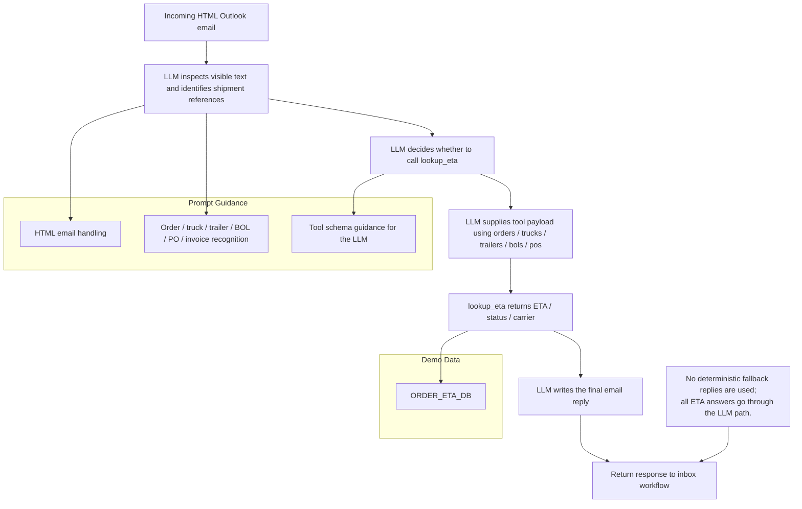
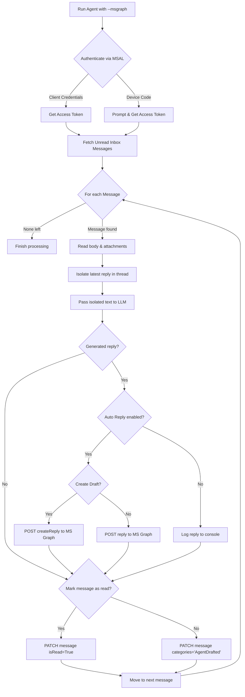

# Email ETA Agent Logic Flow

```mermaid
flowchart TD
    A[Incoming HTML Outlook email] --> C[LLM inspects visible text and identifies shipment references]
    C --> D[LLM decides whether to call lookup_eta]
    D --> E[LLM supplies tool payload using orders / trucks / trailers / bols / pos]
    E --> F[lookup_eta returns ETA / status / carrier]
    F --> G[LLM writes the final email reply]
    G --> H[Return response to inbox workflow]

    subgraph Prompt Guidance
        I[HTML email handling]
        J[Order / truck / trailer / BOL / PO / invoice recognition]
        K[Tool schema guidance for the LLM]
    end

    C --> I
    C --> J
    D --> K

    subgraph Demo Data
        L[ORDER_ETA_DB]
    end

    F --> L

    note1[No deterministic fallback replies are used;
all ETA answers go through the LLM path.] --> H
```

## MS Graph Integration Flow

```mermaid
flowchart TD
    Start[Run Agent with --msgraph] --> Auth{Authenticate via MSAL}
    Auth -->|Client Credentials| Token1[Get Access Token]
    Auth -->|Device Code| Token2[Prompt & Get Access Token]
    Token1 --> Fetch[Fetch Unread Inbox Messages]
    Token2 --> Fetch
    Fetch --> Loop{For each Message}
    Loop -->|None left| End[Finish processing]
    Loop -->|Message found| Read[Read body & attachments]
    Read --> Isolate[Isolate latest reply in thread]
    Isolate --> LLM[Pass isolated text to LLM]
    LLM --> Reply{Generated reply?}

    Reply -->|No| Mark{Mark message as read?}
    Reply -->|Yes| SendReply{Auto Reply enabled?}
    SendReply -->|Yes| DraftMode{Create Draft?}
    SendReply -->|No| LogReply[Log reply to console]
    DraftMode -->|Yes| CreateDraft[POST createReply to MS Graph]
    DraftMode -->|No| PostReply[POST reply to MS Graph]
    CreateDraft --> Mark
    PostReply --> Mark
    LogReply --> Mark
    Mark -->|Yes| PatchRead[PATCH message isRead=True]
    Mark -->|No| PatchCategory[PATCH message categories='AgentDrafted']
    PatchRead --> Next[Move to next message]
    PatchCategory --> Next
    Next --> Loop
```

